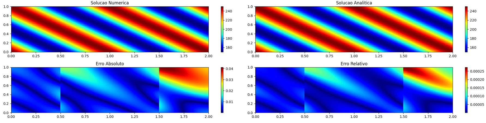

# 2D Pure Diffusion Finite Volume Solver

This repository contains a **2D Finite Volume Method (FVM) solver** for the steady-state **heat diffusion equation** with spatially varying thermal conductivity. The solver was implemented in **Python** and validated using the **Method of Manufactured Solutions (MMS)** to ensure consistency between analytical and numerical solutions.

---

## Overview

The code discretizes the **2D steady-state diffusion equation** using the **Finite Volume Method** on a structured mesh and solves the resulting linear system using:

- A **Direct Solver** (`numpy.linalg.solve`)
- **Gauss–Seidel Iterative Solver**
- **Gauss–Seidel with Successive Over-Relaxation (SOR)**

The solver was benchmarked on multiple grid refinements, comparing **accuracy, execution time, memory consumption, and convergence** for each method.

---

## Features

- **Finite Volume Method (FVM)** discretization for 2D diffusion
- Uses the **Method of Manufactured Solutions (MMS)** for validation
- Three solution approaches:
  - Direct Solver (fast for small systems)
  - Iterative Gauss–Seidel
  - Gauss–Seidel with **SOR** (faster convergence)
- Mesh refinement up to **320×160**
- Generates contour plots for:
  - Numerical solution
  - Analytical solution
  - Absolute error
  - Relative error

---

## Repository Structure

- README.md #This File
- 2D_Pure_Diffusion_CFD_Code_Report.pdf # Technical report, with theory, methodology and results/discussion.
- Code
- Figures

## Example Plots

## Author

António Reis  
MSc Aerospace Engineering — Aerodynamics | CFD | Numerical Methods  
🔗 [LinkedIn](https://www.linkedin.com/in/antónio-reis-615471327)
